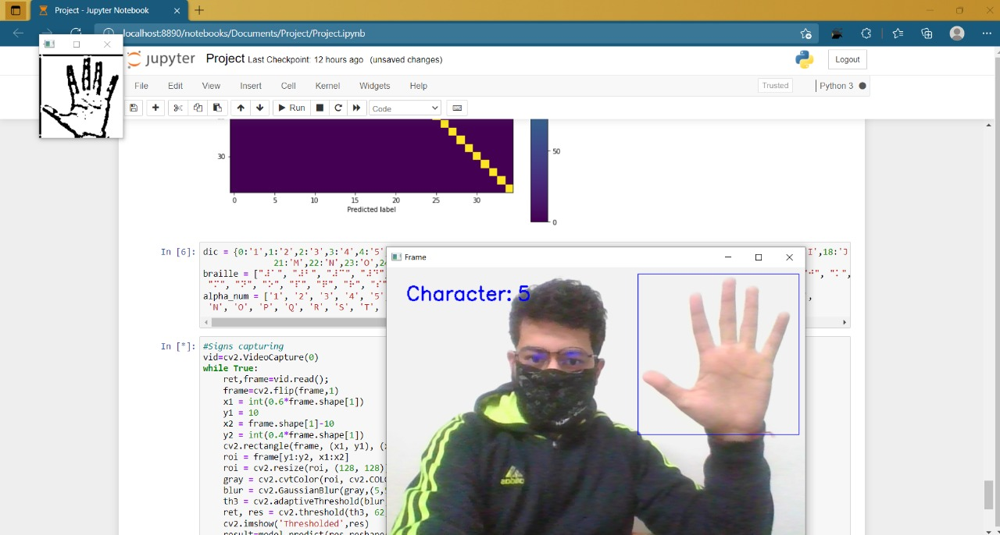

# Harpia-Harpyja
> Sign language to Braille image conversion using OpenCV and TensorFlow
  

Our project aims to create a  computer application and train  a model which when shown a  real time video of hand gestures  of Sign Language  shows the output for that particular sign in braille format on the screen.

  
Our Project's working Image  
  

Our Project's model `Accuracy graph`  
  

Our Project's model `Loss graph`  
  

Our Project's model `Confusion Matrix`  
  

 

- for this project we have used *[Indian Sign Language Dataset](https://www.kaggle.com/vaishnaviasonawane/indian-sign-language-dataset)* dataset
